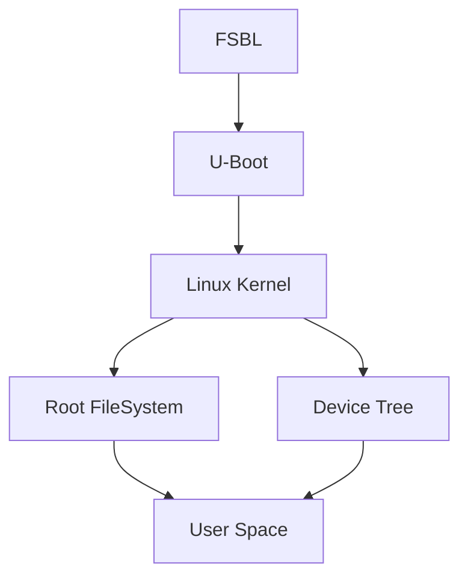

# Processus de Boot

Le processus de boot d'un système embarqué sur la Zybo Z7-20 est structuré en plusieurs étapes. Cette organisation en étapes est essentielle pour gérer la complexité du démarrage, l'initialisation progressive des composants matériels, et la configuration logicielle. Voici une explication de chaque étape et pourquoi elles sont nécessaires.

## Schéma du Processus de Boot



### 1. First Stage Bootloader (FSBL)

Le FSBL est le premier programme à s'exécuter après la mise sous tension du système.

#### Fonctions principales

- Initialiser les composants matériels de base comme la mémoire DDR et les périphériques critiques.
- Charger et transférer le contrôle au Second Stage Bootloader (U-Boot).

#### Pourquoi utiliser un FSBL ?

Historiquement, une version allégée d'U-Boot suffisait pour programmer la mémoire flash car elle tenait dans la mémoire On-Chip Memory (OCM). Cependant, avec l'ajout de la prise en charge de nouvelles familles de flash, la taille d'U-Boot a augmenté, nécessitant l'utilisation de la mémoire DDR pour son exécution. Le FSBL est donc nécessaire pour initialiser la mémoire DDR et autres modules avant de charger U-Boot ([xilinx support](https://support.xilinx.com/s/question/0D52E00006hptGcSAI/why-does-program-flash-require-an-fsbl?language=en_US#:~:text=URL%3A%20https%3A%2F%2Fsupport.xilinx.com%2Fs%2Fquestion%2F0D52E00006hptGcSAI%2Fwhy,100))

#### Emplacement en mémoire

Le FSBL est stocké dans la mémoire non volatile (NOR flash, QSPI flash) et est exécuté dès la mise sous tension pour initialiser la mémoire DDR et autres périphériques nécessaires.


### 2. U-Boot (Universal Bootloader)

**U-Boot** (Das U-Boot) est un bootloader open-source de deuxième niveau utilisé par de nombreuses plateformes embarquées. Il est responsable des tâches plus complexes. Ses fonctions incluent :

- Initialiser les périphériques matériels supplémentaires non gérés par le FSBL.
- Charger le noyau Linux en mémoire.
- Charger le Device Tree Blob (DTB) et le Root FileSystem (RFS).
- Fournir une interface pour des configurations supplémentaires et le débogage.

!!! note "Pour plus d'informations"
    [le site officiel de U-Boot](https://www.denx.de/wiki/U-Boot).
    [le dépôt GitHub de U-Boot](https://github.com/u-boot/u-boot).


### 3. Linux Kernel

Le **noyau Linux** est le cœur du système d'exploitation. Une fois chargé par U-Boot, il effectue les opérations suivantes :

- Initialiser le matériel en utilisant les informations fournies par le Device Tree.
- Monter le Root FileSystem.
- Lancer le processus initial (init).

### 4. Device Tree

Le **Device Tree** est une structure de données qui décrit le matériel présent sur la carte. Il fournit au noyau Linux les informations nécessaires pour initialiser et gérer les périphériques matériels.

#### Pourquoi utiliser un Device Tree ?

Le Device Tree permet de maintenir le noyau Linux générique, sans avoir besoin de coder des détails matériels spécifiques dans le noyau lui-même. Cela permet de porter le même noyau sur différentes plateformes matérielles, simplement en modifiant le Device Tree. Cette flexibilité est cruciale pour le développement et la maintenance de systèmes embarqués.

!!! example "Exemple de Device Tree"
    ```json
    {
      "compatible": "digilent,zybo-z7",
      "model": "Digilent Zybo Z7",
      "memory": {
        "device_type": "memory",
        "reg": "0x10000000"
      },
      "cpus": {
        "cpu@0": {
          "device_type": "cpu",
          "compatible": "arm,cortex-a9"
        }
      }
    }
    ```

### 5. Root FileSystem (RFS)

Le **Root FileSystem (RFS)** fournit le contexte et les ressources nécessaires au noyau Linux pour exécuter des applications et des services. Sans un système de fichiers monté, le noyau ne peut pas accéder aux fichiers et aux commandes nécessaires pour démarrer le système et exécuter des tâches.

Le RFS inclut généralement :

- **Bibliothèques partagées** : Fichiers nécessaires pour le fonctionnement des applications.
- **Utilitaires système** : Commandes et programmes essentiels comme `bash`, `ls`, `cp`, etc.
- **Fichiers de configuration** : Paramètres de configuration pour les services et les applications.
- **Applications** : Programmes nécessaires au fonctionnement de l'utilisateur et du système.

!!! note "Options pour obtenir un Root FileSystem"
    - **Téléchargez un Root FileSystem pré-construit** depuis une source fiable, comme [RCN-EE](https://rcn-ee.com/rootfs/eewiki/minfs/).
    - Utiliser un **Outil de construction** tel que **Buildroot** ou **Yocto** pour générer un Root FileSystem personnalisé.

### 6. User Space

L'**User Space** est l'environnement dans lequel s'exécutent les applications et les services utilisateurs. Après le montage du Root FileSystem et le lancement du processus initial, le contrôle passe à l'User Space.

Le User Space permet aux utilisateurs et aux applications de fonctionner indépendamment du noyau. Cela isole les processus utilisateurs des opérations critiques du noyau. Le User Space comprend toutes les applications, bibliothèques et services nécessaires pour que le système soit fonctionnel et interactif.

---

## Table récapitulative

| Composant       | Fonction principale                                                                                         |
|-----------------|-------------------------------------------------------------------------------------------------------------|
| FSBL            | Initialiser le matériel de base et charger U-Boot                                                           |
| U-Boot          | Initialiser des périphériques supplémentaires, charger le noyau Linux, le Device Tree et le Root FileSystem |
| Linux Kernel    | Initialiser le matériel, monter le Root FileSystem et lancer le processus initial                           |
| Device Tree     | Décrire le matériel pour le noyau Linux                                                                     |
| Root FileSystem | Contenir tous les fichiers nécessaires pour le système d'exploitation                                       |
| User Space      | Environnement pour l'exécution des applications et services utilisateurs                                    |
