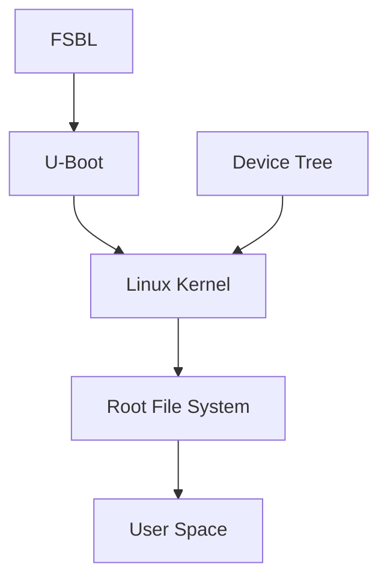

# Processus de Boot

## Introduction

Le processus de boot d'un système embarqué sur la Zybo Z7-20 est structuré en plusieurs étapes. Cette organisation en étapes est essentielle pour gérer la complexité du démarrage, l'initialisation progressive des composants matériels, et la configuration logicielle. Voici une explication de chaque étape et pourquoi elles sont nécessaires.

## Les Étapes du Processus de Boot




### 1. First Stage Bootloader

Le **FSBL** est le premier programme à s'exécuter après la mise sous tension du système. 
Il est stocké dans la mémoire non volatile (NOR flash, QSPI flash) et ses principales fonctions sont d'initialiser les composants matériels de base comme la mémoire DDR et les périphériques critiques, puis de charger et transférer le contrôle au Second Stage Bootloader.

!!! info "Pourquoi utiliser un FSBL ?"
    Historiquement, une version allégée d'U-Boot suffisait pour programmer la mémoire flash car elle tenait dans la mémoire OCM. Avec l'ajout de la prise en charge de nouvelles familles de flash, la taille d'U-Boot a augmenté, nécessitant l'utilisation de la mémoire DDR pour son exécution. Le FSBL est donc nécessaire pour initialiser la mémoire DDR et autres modules avant de charger U-Boot ([xilinx support](https://support.xilinx.com/s/question/0D52E00006hptGcSAI/why-does-program-flash-require-an-fsbl?language=en_US#:~:text=URL%3A%20https%3A%2F%2Fsupport.xilinx.com%2Fs%2Fquestion%2F0D52E00006hptGcSAI%2Fwhy,100)).

### 2. Universal Bootloader

**U-Boot** (Das U-Boot) est un bootloader open-source de deuxième niveau utilisé par de nombreuses plateformes embarquées. Il est responsable des tâches plus complexes. Ses fonctions incluent :

- Initialiser les périphériques matériels supplémentaires non gérés par le FSBL.
- Charger le noyau Linux en mémoire.
- Charger le Device Tree Blob (DTB) et le Root File System (RFS).
- Fournir une interface pour des configurations supplémentaires et le débogage.

!!! note "Pour plus d'informations"
    Consultez [le site officiel de U-Boot](https://www.denx.de/wiki/U-Boot) et [le dépôt GitHub de U-Boot](https://github.com/u-boot/u-boot).


### 3. Linux Kernel

Le **noyau Linux** est le cœur du système d'exploitation, responsable de la gestion des ressources matérielles et de l'exécution des processus. Une fois chargé par U-Boot, il effectue plusieurs opérations critiques :

- **Initialisation du matériel** : Le noyau utilise les informations fournies par le [Device Tree](#4-device-tree) pour configurer et initialiser les périphériques matériels du système.
- **Montage du [Root File System](#5-root-file-system)** : Le noyau monte le système de fichiers racine, qui contient tous les fichiers nécessaires pour le fonctionnement du système d'exploitation.
- **Lancement du processus initial (init)** : Le noyau démarre le processus init, qui est le premier processus utilisateur lancé par le noyau et qui reste en cours d'exécution jusqu'à l'arrêt du système. Ce processus init initialise les autres processus et services du système.

!!! note "Pour plus d'informations"
    Pour plus d'informations et pour approfondir vos connaissances sur le noyau Linux, consultez les ressources suivantes :

    - [Documentation officielle du noyau Linux](https://www.kernel.org/doc/)
    - [Référentiel GitHub du noyau Linux](https://github.com/torvalds/linux)

### 4. Device Tree

Le **Device Tree** est une structure qui décrit le matériel présent sur la carte. Il fournit au noyau Linux les informations nécessaires pour initialiser et gérer les périphériques matériels.

!!! info "Pourquoi utiliser un Device Tree ?"
    Le Device Tree permet de maintenir le noyau Linux générique, sans avoir besoin de coder des détails matériels spécifiques dans le noyau lui-même. Cela permet de porter le même noyau sur différentes plateformes matérielles, simplement en modifiant le Device Tree. Cette flexibilité est cruciale pour le développement et la maintenance de systèmes embarqués.

!!! example "Exemple de Device Tree"
    ```json
    {
      "compatible": "digilent,zybo-z7",
      "model": "Digilent Zybo Z7",
      "memory": {
        "device_type": "memory",
        "reg": "0x10000000"
      },
      "cpus": {
        "cpu@0": {
          "device_type": "cpu",
          "compatible": "arm,cortex-a9"
        }
      }
    }
    ```

### 5. Root File System

Le **RFS** fournit le contexte et les ressources nécessaires au noyau Linux pour exécuter des applications et des services. Sans un système de fichiers monté, le noyau ne peut pas accéder aux fichiers et aux commandes nécessaires pour démarrer le système et exécuter des tâches.

Le RFS inclut généralement :

- **Bibliothèques partagées** : Fichiers nécessaires pour le fonctionnement des applications.
- **Utilitaires système** : Commandes et programmes essentiels comme `bash`, `ls`, `cp`, etc.
- **Fichiers de configuration** : Paramètres de configuration pour les services et les applications.
- **Applications** : Programmes nécessaires au fonctionnement de l'utilisateur et du système.

!!! note "Options pour obtenir un RFS"
    - **Téléchargez un RFS pré-construit** depuis une source fiable, comme [RCN-EE](https://rcn-ee.com/rootfs/eewiki/minfs/).
    - Utiliser un **Outil de construction** tel que [**Buildroot**](https://www.buildroot.org/) ou [**Yocto**](https://www.yoctoproject.org/) pour générer un RFS personnalisé.

### 6. User Space

L'**User Space** est l'environnement dans lequel s'exécutent les applications et les services utilisateurs. Après le montage du RFS et le lancement du processus initial, le contrôle passe à l'espace utilisateur.

Le User Space permet aux utilisateurs et aux applications de fonctionner indépendamment du noyau. Cela isole les processus utilisateurs des opérations critiques du noyau. Le User Space comprend toutes les applications, bibliothèques et services nécessaires pour que le système soit fonctionnel et interactif.

---

## Table récapitulative

| Composant       | Fonction principale                                                                                         |
|-----------------|-------------------------------------------------------------------------------------------------------------|
| FSBL            | Initialiser le matériel de base et charger U-Boot                                                           |
| U-Boot          | Initialiser des périphériques supplémentaires, charger le noyau Linux, le Device Tree et le RFS             |
| Linux Kernel    | Initialiser le matériel, monter le RFS et lancer le processus initial                                       |
| Device Tree     | Décrire le matériel pour le noyau Linux                                                                     |
| Root File System | Contenir tous les fichiers nécessaires pour le système d'exploitation                                      |
| User Space      | Environnement pour l'exécution des applications et services utilisateurs                                    |
