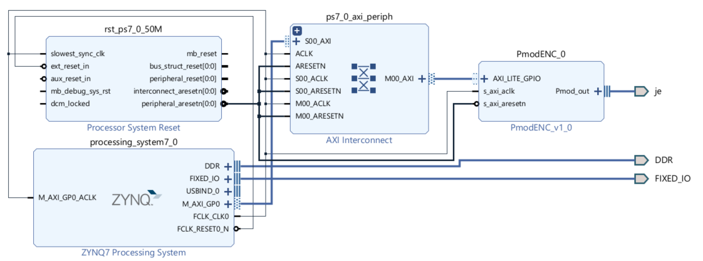

# Application Encoder sur baremetal Zybo

## Introduction

Ce projet a pour but de contrôler un encodeur rotatif Digilent PmodENC sur la carte Zybo Z7-20 en utilisant un projet baremetal en C avec Vitis. L'encodeur rotatif est un composant qui permet de mesurer la rotation d'un axe. Il est composé de deux signaux A et B qui sont en quadrature. L'encodeur est connecté au port JE de la carte Zybo Z7-20.

Ce projet est disponible sur [GitHub](https://github.com/TER-Zybo/Baremetal_ENC).

## Génération du Matériel avec Vivado



L'objectif est de générer un fichier XSA. Vous pouvez vous référer au [Tutoriel Pmod-IPs Digilent](https://digilent.com/reference/learn/programmable-logic/tutorials/pmod-ips/start) pour plus d'informations.

### Étapes

1.  Créer un projet Vivado avec la carte Zybo Z7-20.

2.  Créer un block design et y ajouter les éléments suivants :
    - Zynq
    - PmodENC_v1_0 connecté au port JE

3.  Connecter automatiquement les composants puis valider le design.

4.  Générer le bitstream.

5.  Exporter le matériel avec le bitstream inclus.


## Application Baremetal avec Vitis

Depuis Vivado, sélectionner `Tools -> Launch Vitis IDE`.

### Étapes

1.  Ouvrir un workspace.
2.  Créer un composant plateforme :
    - Nom : platform_enc
    - Sélectionner le fichier XSA précédemment généré
3.  Créer un composant application :
    - Nom : app_enc
    - Plateforme : platform_enc (créé précédemment)

### Importer les fichiers nécessaires

- Copier `PmodENC.c` et `PmodENC.h` disponibles depuis `platform_enc/Source/hw/sdt/drivers/PmodENC_V1_0/src` dans `app_enc/Sources/src`.
- Copier `main.c` disponible depuis `platform_enc/Source/hw/sdt/drivers/PmodENC_V1_0/examples` dans `app_enc/Sources/src`.

### Configuration du GPIO

Ajouter la ligne suivante dans le fichier `main.c` :

```
#define XPAR_PMODENC_0_AXI_LITE_GPIO_BASEADDR 0x40000000
```
Cette definition est nécessaire pour spécifier l'adresse de base du GPIO. Cette adresse est définie dans le [device tree](device_tree.md). Veillez à ce que cette adresse corresponde à celle définie dans le device tree.

### Configuration du projet

Il est nécessaire de configurer le projet pour qu'il puisse être exécuté sur la carte Zybo Z7-20. Modifier `Board Initialization` à `FSBL` dans le fichier `launch.json`.

### Compilation et connexion

1. Compiler l'application (plateforme incluse).
2. Connecter le module ENC à la partie supérieure du port JE.
3. Brancher le câble USB à l'ordinateur.
4. Connecter vous au terminal série. 115200 bauds.
5. Lancer l'application.